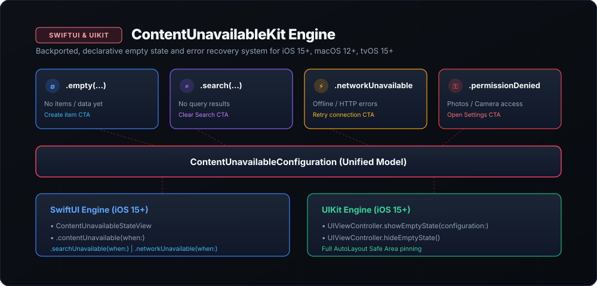

# ContentUnavailableKit



[](https://swift.org)
[](#platforms)
[](LICENSE)
[](#architecture)

A lightweight, declarative empty state and error recovery framework for iOS, macOS, and tvOS. Backports modern `ContentUnavailableView` (iOS 17+) conventions down to iOS 15 & macOS 12 with full UIKit and SwiftUI support.

---

## The Problem

Apple introduced `ContentUnavailableView` (SwiftUI) and `UIContentUnavailableConfiguration` (UIKit) in iOS 17. However:
1. Most production iOS applications still maintain minimum deployment targets of **iOS 15 or iOS 16**.
2. Building custom empty states across dozens of screens leads to inconsistent typography, broken safe area handling, and duplicated layout code.
3. Bridging empty states across hybrid SwiftUI and UIKit view controllers requires awkward boilerplate.

`ContentUnavailableKit` provides a unified, cross-framework architecture that works seamlessly across iOS 15 through iOS 18+.

---

## Highlights

- 📦 **Standard Presets**:
  - 🔍 **Search Unavailable (`.search(query:onClear:)`)**: Displays "No Results for [Query]" with suggested actions and a "Clear Search" button.
  - 🌐 **Network Unavailable (`.networkUnavailable(onRetry:)`)**: Displays offline indicator with an asynchronous "Retry" action.
  - 📭 **Empty Data (`.empty(title:description:systemImage:actionTitle:action:)`)**: Guides users to create their first item or document.
  - 🔒 **Permission Denied (`.permissionDenied(permissionName:onOpenSettings:)`)**: Deep-links users to system privacy settings.
- 🎨 **SwiftUI Native Modifiers**: Overlay empty states conditionally with `.emptyState(when:)`, `.searchUnavailable(when:)`, and `.networkUnavailable(when:)`.
- 🏛️ **UIKit UIViewController Integration**: Instantly attach or detach empty states on `UIViewController` with `showEmptyState(configuration:)` and `hideEmptyState()`.
- 🔒 **Swift 6 Strict Concurrency**: 100% `Sendable` compliant configuration objects and handlers.
- 🚀 **Zero Dependencies**: Pure Foundation, SwiftUI, and UIKit.

---

## Installation

Add `ContentUnavailableKit` to your `Package.swift`:

```swift
dependencies: [
    .package(url: "https://github.com/nilkanthdesai76/swift-content-unavailable-kit.git", from: "1.0.0")
]
```

Or in Xcode: **File** → **Add Package Dependencies...** → Enter repository URL.

---

## Quick Start

### SwiftUI

```swift
import SwiftUI
import ContentUnavailableKit

struct DocumentsListView: View {
    @State private var documents: [Document] = []
    @State private var searchQuery: String = ""
    @State private var isOffline: Bool = false

    var body: some View {
        List(filteredDocuments) { doc in
            Text(doc.title)
        }
        // 1. Empty List State
        .emptyState(
            when: documents.isEmpty && !isOffline,
            title: "No Documents Yet",
            description: "Scan or import a PDF to start organizing your files.",
            systemImage: "doc.badge.plus",
            actionTitle: "Import Document"
        ) {
            importDocument()
        }
        // 2. Search Not Found State
        .searchUnavailable(
            when: !searchQuery.isEmpty && filteredDocuments.isEmpty,
            query: searchQuery
        ) {
            searchQuery = ""
        }
        // 3. Network Offline State
        .networkUnavailable(when: isOffline) {
            retryFetch()
        }
    }
}
```

### UIKit

```swift
import UIKit
import ContentUnavailableKit

class BookmarksViewController: UIViewController {
    var bookmarks: [Bookmark] = []

    func updateUI() {
        if bookmarks.isEmpty {
            showEmptyState(
                configuration: .empty(
                    title: "No Bookmarks",
                    description: "Saved articles and links will appear here.",
                    systemImage: "bookmark",
                    actionTitle: "Explore Articles"
                ) { [weak self] in
                    self?.openExplore()
                }
            )
        } else {
            hideEmptyState()
        }
    }
}
```

---

## License

MIT License. See [LICENSE](LICENSE) for details.
Authored by [Nilkanth Desai](https://github.com/nilkanthdesai76).
